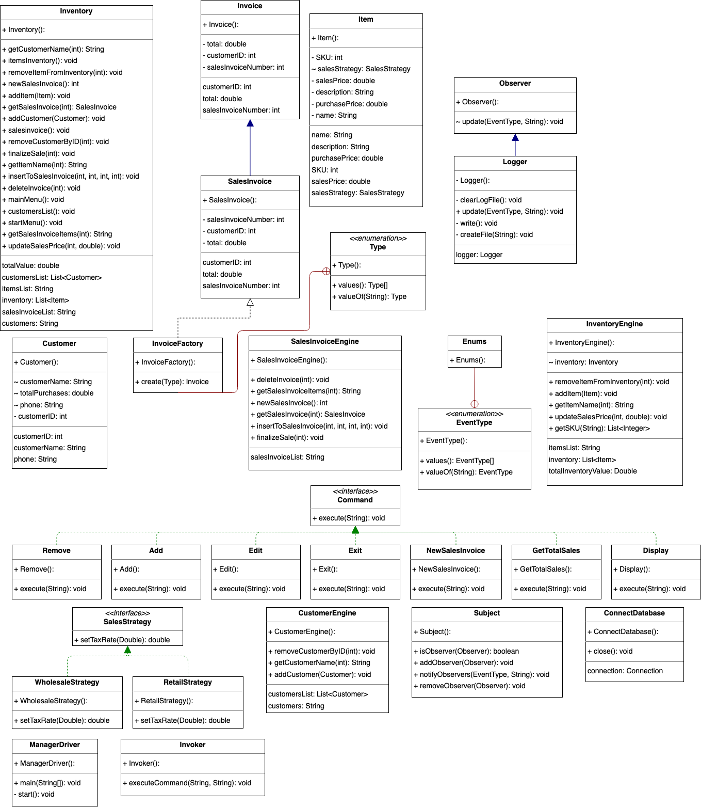

Java Version: Oracle OpenJDK Version 18.0.1

Additional Comments:

Project Title: Inventory Manager
--------------

Instructions
--------------
Use Gradle for JUnit testing and database dependencies

Uses local MySQL Database  
Connector: mysql-connector-java:8.0.30

Run the SQLScript to generate the databse in MySQL
Edit the user and password in ConnectDatabase.java file located in java/com/database directory

Recommend using IntelliJ to run code. 
On IntelliJ, run ManagerDriver.java to start application.

MySQL Schema 
--------------

Java Classes UML 
--------------

Features 
--------------
• Items:  
    &emsp;&emsp;&emsp;&emsp;-Add/Remove inventory of items  
    &emsp;&emsp;&emsp;&emsp;-Edit item sales prices  

• Sales Invoice:  
    &emsp;&emsp;&emsp;&emsp;-Able to input sales invoice information  
    &emsp;&emsp;&emsp;&emsp;-Can add multiple items to invoice or remove Items  
    &emsp;&emsp;&emsp;&emsp;-Generate total of item type with quantity and subtotals for items with quantity designator  
    &emsp;&emsp;&emsp;&emsp;-Link invoice to specific customer  

• Customer:  
    &emsp;&emsp;&emsp;&emsp;-Able to add customers  
    &emsp;&emsp;&emsp;&emsp;-Get total of customer purchases  

